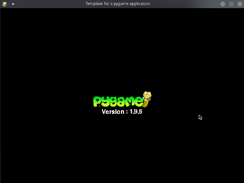

# pygame_template

This project contains a simple template for pygame developement.

This template shows:
 - How to initialize a project
 - Handle event
 - Separate game logic from display logic
 - Render a surface
 - Specify a "Frame per second" render
 
 The features hilited are:
 - Load an image
 - Display background Color
 - Display an image
 - Display some text
 - Handle quit Event
